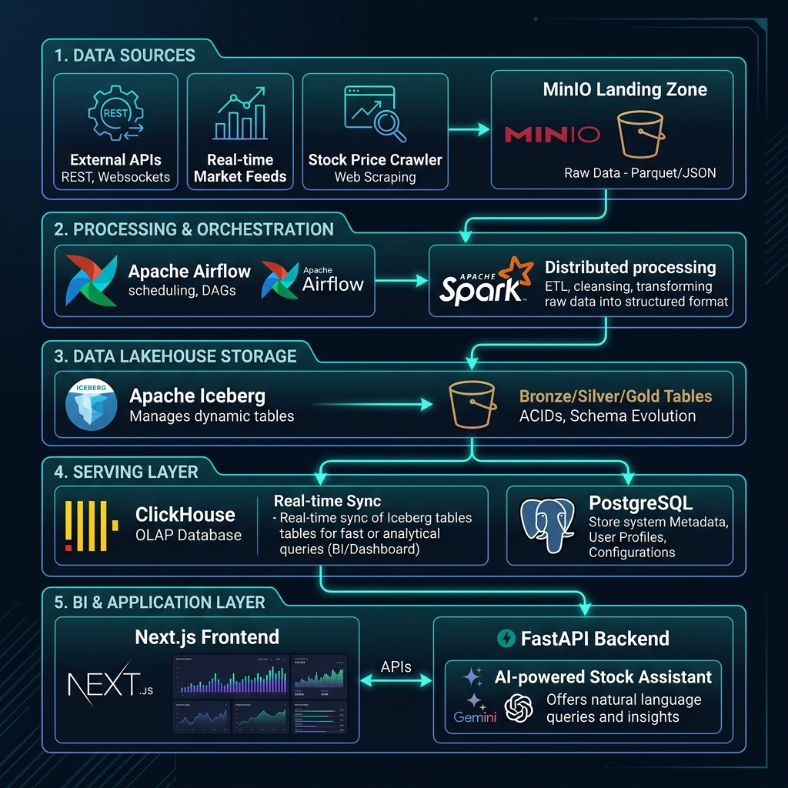

# VNese Stock Analytic System - Stock Warehouse

Hệ thống phân tích chứng khoán toàn diện (Stock Warehouse) kết hợp giữa **Datalake/Lakehouse (Data Pipeline)** hiện đại và **Nền tảng phân tích doanh nghiệp trực quan (BI Platform)**. Hệ thống cung cấp giải pháp thu thập dữ liệu tự động, xử lý phân tán quy mô lớn, lưu trữ tối ưu cho phân tích (OLAP), và hiển thị biểu đồ phân tích trực quan sinh động.

---

## 🗺️ Sơ đồ Kiến trúc & Luồng Dữ liệu (Data Flow Architecture)

Dưới đây là sơ đồ luồng dữ liệu tổng quan từ nguồn thu thập (Ingestion) cho tới lớp hiển thị ứng dụng (BI Platform):



---

## 1. Nền tảng BI (BI Platform)

Nền tảng BI được thiết kế theo kiến trúc tách biệt Frontend và Backend, tối ưu hóa cho cả trải nghiệm người dùng trực quan thời gian thực và khả năng phân tích dữ liệu lớn.

### 💻 Frontend (`bi-platform/FE`)
Xây dựng trên nền tảng **Next.js (React & TypeScript)** hiện đại, cung cấp các phân hệ hiển thị:
*   **Bảng giá trực tuyến (Real-time Electric Board):** Hiển thị trực quan các bước giá, dao động giá thời gian thực của các mã cổ phiếu thông qua kết nối Websocket ổn định.
*   **Phân tích báo cáo tài chính chuyên sâu (Financial Deep-Dive):** Báo cáo kết quả kinh doanh (Income Statement), Bảng cân đối kế toán (Balance Sheet), Lưu chuyển tiền tệ (Cash Flow). Hỗ trợ trực quan hóa bằng các biểu đồ xu hướng.
*   **Chỉ số tài chính (Financial Ratios):** So sánh định giá (P/E, P/B), hiệu quả hoạt động (ROE, ROA), cơ cấu tài sản và nguồn vốn.
*   **Phân tích định lượng & Kỹ thuật (Quant & Technical Analysis):** Công cụ lọc cổ phiếu (Stock Screener), tính toán các chỉ báo kỹ thuật cơ bản.
*   **Phân tích tâm lý tin tức (News Sentiment Analysis):** Tự động tổng hợp tin tức tài chính liên quan đến doanh nghiệp và đánh giá tâm lý thị trường (tích cực/tiêu cực).

### ⚙️ Backend API (`bi-platform/BE`)
Xây dựng bằng **FastAPI (Python)** - framework đạt hiệu năng xử lý cao và độ trễ thấp, kết nối với hệ thống cơ sở dữ liệu đa tầng:
*   **ClickHouse (OLAP Engine):** Sử dụng driver `clickhouse-connect` để thực hiện các truy vấn phân tích, thống kê, và tổng hợp dữ liệu tài chính khổng lồ chỉ trong vài mili-giây.
*   **PostgreSQL (OLTP Engine):** Sử dụng `SQLAlchemy` (Async) và `Alembic` để lưu trữ dữ liệu nghiệp vụ: tài khoản người dùng, cấu hình cá nhân hóa, hệ thống cảnh báo (alerts) và metadata.
*   **Redis (Caching & Message Broker):** Lưu trữ tạm (cache) các dữ liệu truy vấn thường xuyên để giảm tải cho database, đồng thời làm broker cho luồng dữ liệu thời gian thực (Websockets).

---

## 2. Luồng Dữ liệu cụ thể (Data Pipeline & Lakehouse)

Hệ thống Data Pipeline được thiết kế theo mô hình **Modern Data Lakehouse** (Medallion Architecture) nhằm lưu trữ dữ liệu linh hoạt và tin cậy cao.

### 📥 Lớp Ingestion (Thu thập dữ liệu)
*   Các Worker (viết bằng Python) tự động crawl và gọi API từ các nguồn dữ liệu tài chính uy tín để thu cập: báo cáo tài chính (BCTC), giá lịch sử, bảng giá trực tuyến hàng ngày, tin tức doanh nghiệp, chỉ số vĩ mô thế giới (DXY, giá Dầu, giá Vàng - XAU, Dow Jones) và vĩ mô Việt Nam.
*   Dữ liệu thô sau khi thu thập được đẩy trực tiếp vào **MinIO Landing Zone** (tương thích chuẩn Amazon S3) được phân chia thư mục (partitioned) theo ngày/giờ và định dạng thô (CSV, Parquet).

### 🌀 Lớp Orchestration & Processing (Điều phối & Xử lý)
*   **Apache Airflow** chịu trách nhiệm lập lịch và điều phối (orchestrate) toàn bộ quy trình:
    1.  Kích hoạt các tác vụ download định kỳ.
    2.  Gọi API tới `spark_cmd_server` trên container Spark Master để submit các job xử lý dữ liệu.
*   **Apache Spark** đảm nhận vai trò tính toán và xử lý phân tán:
    *   Đọc dữ liệu thô từ MinIO Landing Zone.
    *   Chuẩn hóa kiểu dữ liệu, loại bỏ nhiễu, xử lý trùng lặp và liên kết dữ liệu giữa các bảng chiều (Dimensions) và bảng sự kiện (Facts).
    *   Ghi dữ liệu dưới định dạng **Apache Iceberg** - chuẩn định dạng bảng mở (Open Table Format) mang lại tính năng ACID transactions, time travel, và schema evolution trực tiếp trên Object Storage.

### 🗄️ Lớp Storage & Serving (Lưu trữ & Phục vụ)
*   Dữ liệu sau khi xử lý được lưu trữ dưới dạng các bảng Iceberg trên MinIO.
*   **ClickHouse** tích hợp trực tiếp với Datalake thông qua **Iceberg Engine**. Nhờ đó, ClickHouse có thể đọc và truy vấn trực tiếp dữ liệu từ các tệp Parquet của Iceberg trên MinIO một cách tự động khi có dữ liệu mới. Lớp BI FastAPI chỉ việc kết nối vào ClickHouse để truy xuất dữ liệu với tốc độ của một cơ sở dữ liệu cột (Columnar Database) mà không cần thêm bước đồng bộ thủ công từ Datalake về Data Warehouse.

Các bảng dữ liệu chính trong hệ thống:
*   `fact_financial_reports`: Dữ liệu báo cáo tài chính chi tiết của các doanh nghiệp.
*   `fact_history_price`: Lịch sử giá cổ phiếu qua các ngày.
*   `fact_financial_ratios`: Các chỉ số tài chính được tính toán sẵn.
*   `fact_market_index`: Điểm số và biến động của các chỉ số thị trường (VNIndex, HNXIndex...).
*   `fact_macro_economy`: Giá vàng, giá dầu, tỷ giá ngoại tệ, chỉ số kinh tế quốc tế.
*   `fact_realtime_quotes`: Dữ liệu khớp lệnh thời gian thực của cổ phiếu.
*   `dim_company` & `dim_owner`: Thông tin chi tiết doanh nghiệp và ban lãnh đạo.

---

## 🛠️ Hướng dẫn khởi chạy hệ thống (Quick Start)

Dự án được container hóa hoàn toàn bằng Docker giúp việc cài đặt và chạy thử nhanh chóng.

### Bước 1: Khởi chạy Data Pipeline & Lakehouse
Di chuyển vào thư mục ETL và chạy docker-compose:
```bash
cd data-pipeline/etl
docker-compose up -d
```
*Giao diện Airflow Webserver sẽ hoạt động tại: `http://localhost:8080` (Tài khoản mặc định: `airflow` / `airflow`).*
*Giao diện MinIO Console sẽ hoạt động tại: `http://localhost:9001`.*

### Bước 2: Khởi chạy Nền tảng BI (BI Platform)
Khởi chạy cả Backend và Frontend của nền tảng BI:
```bash
cd ../../bi-platform
docker-compose up -d
```
*Frontend Next.js sẽ hoạt động tại: `http://localhost:3000`.*
*FastAPI Backend Swagger docs sẽ hoạt động tại: `http://localhost:8000/docs`.*
