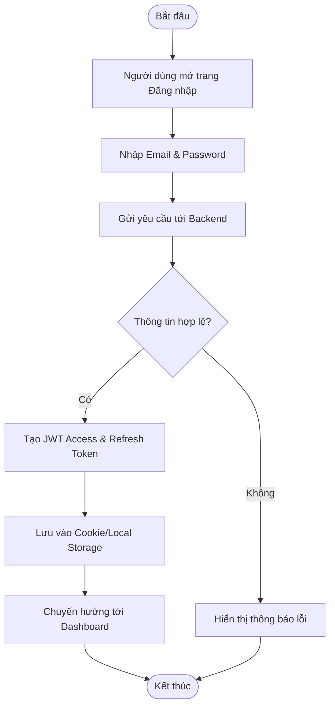
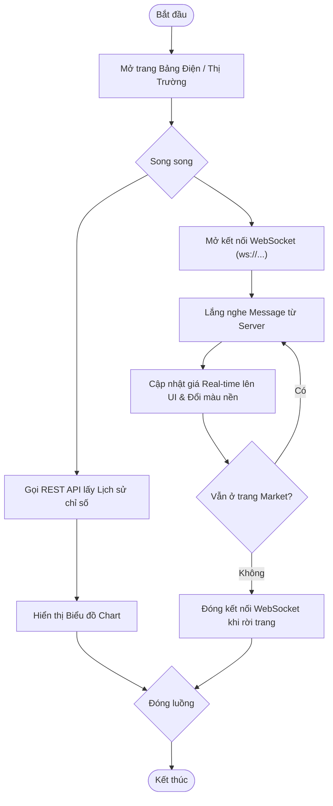
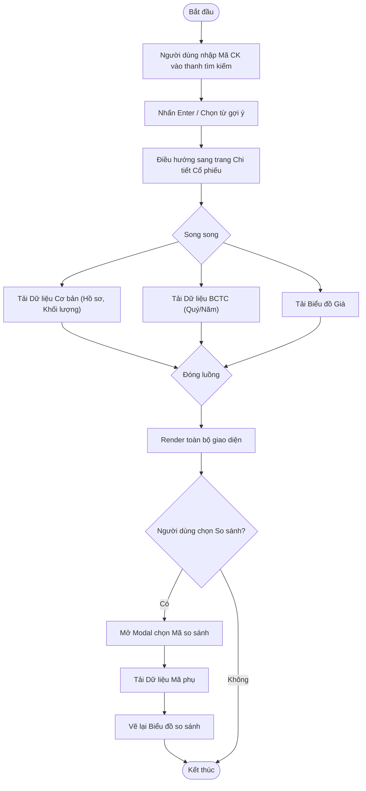
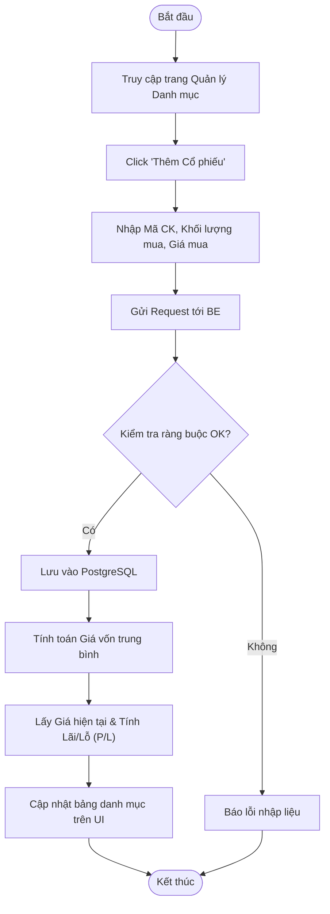
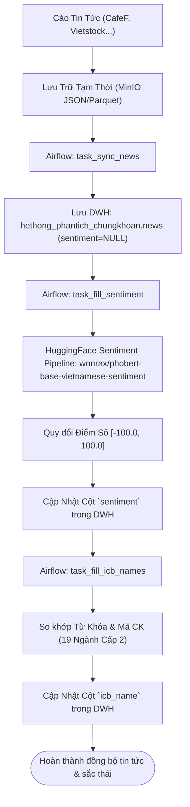
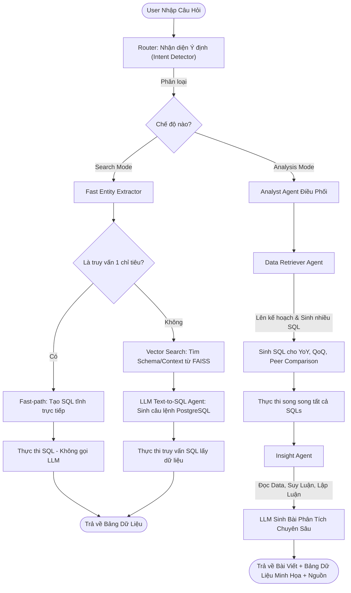

# 📈 Hệ Thống Phân Tích Chứng Khoán (Stock Analysis System)

Dự án phát triển nền tảng web cung cấp giải pháp toàn diện cho nhà đầu tư chứng khoán, bao gồm theo dõi diễn biến thị trường theo thời gian thực, phân tích chuyên sâu báo cáo tài chính doanh nghiệp, quản lý danh mục đầu tư và một **Trợ lý Ảo AI (RAG Chatbot)** thông minh hỗ trợ hỏi đáp dữ liệu tài chính qua ngôn ngữ tự nhiên.

---

## 1. Tổng Quan Kiến Trúc & Công Nghệ

Hệ thống được thiết kế theo mô hình **Client-Server** kết hợp **Microservices-oriented** cho các dịch vụ AI và Data Pipeline.

*   **Frontend (FE):** Next.js (React), TypeScript, TailwindCSS, thư viện Chart (Echarts/Recharts) để vẽ biểu đồ kỹ thuật và trực quan hóa dữ liệu.
*   **Backend (BE):** FastAPI (Python) - xử lý API nhanh, hỗ trợ xử lý bất đồng bộ (async) lý tưởng cho I/O bound và AI stream.
*   **Database:**
    *   **PostgreSQL (DWH):** Lưu trữ toàn bộ dữ liệu tài chính doanh nghiệp, biến động giá, thông tin người dùng.
    *   **Vector Database (FAISS/PGVector):** Lưu trữ metadata schema và tri thức ngành phục vụ RAG.
*   **Trí Tuệ Nhân Tạo (AI/LLM):** OpenAI API (`text-embedding-3-small` và model `gpt-4o-mini`), kiến trúc LlamaIndex/Langchain.
*   **Luồng dữ liệu thời gian thực (Real-time):** Sử dụng WebSockets kết nối giữa FE và BE để cập nhật bảng điện nhanh chóng.

---

## 2. Danh Sách Use Case (Use Case List)

Hệ thống cung cấp các nhóm chức năng chính (Use cases) sau:

1.  **Quản trị Người dùng (Auth & Admin):**
    *   Đăng ký / Đăng nhập / Đổi mật khẩu.
    *   Xác thực đa yếu tố (2FA).
    *   Quản lý thông tin hồ sơ (Profile Settings).
    *   Admin: Quản trị người dùng, phân quyền, xem KPI & log hệ thống.
2.  **Theo dõi Thị trường (Market & Indices):**
    *   Xem bảng điện tổng hợp cập nhật liên tục (Price board).
    *   Xem biến động chỉ số thị trường (VNINDEX, HNX, UPCOM, VN30).
    *   Xem bản đồ dòng tiền, Heatmap, Top cổ phiếu thanh khoản/tăng giảm mạnh.
    *   Đọc tin tức tài chính tổng hợp (News).
3.  **Tra cứu & Phân tích Cổ phiếu (Stock Analysis):**
    *   Xem hồ sơ công ty (Profile), ban lãnh đạo, cổ đông.
    *   Xem biểu đồ phân tích kỹ thuật (Technical Chart).
    *   Phân tích Báo cáo tài chính (Bảng CĐKT, KQKD, LCTT).
    *   Xem các chỉ số định giá (P/E, P/B, ROE, ROA, EPS).
    *   Phân tích định lượng (Quant Analysis).
4.  **Quản lý Danh mục (Portfolio & Alerts):**
    *   Tạo danh mục cổ phiếu theo dõi (Watchlist).
    *   Quản lý danh mục đầu tư (Portfolio Tracking): thêm giao dịch mua/bán, tính lãi/lỗ (P/L).
    *   Xem snapshot rủi ro và tái tính toán rủi ro danh mục.
    *   Cài đặt cảnh báo giá (Price Alerts).
5.  **Trợ lý Ảo AI (RAG Chatbot):**
    *   Hỏi đáp nhanh số liệu tài chính (Search Mode).
    *   Yêu cầu AI viết bài phân tích đa chiều, so sánh các mã cổ phiếu (Analysis Mode).

---

## 3. Mô Tả Chi Tiết Các Modules & Chức Năng (Features & Endpoints)

Dự án được cấu trúc thành các module độc lập và nhất quán, với tất cả API endpoints chạy qua tiền tố chung `/api/v1`:

### 3.1. Module Xác Thực & Thông Tin Người Dùng (Authentication & Profile)
Quản lý đăng ký, đăng nhập, bảo mật và thông tin cá nhân.
*   **Tiền tố Endpoint:** `/api/v1/auth`
*   **Các chức năng chi tiết:**
    *   **Đăng ký tài khoản (`POST /auth/register`):** Tạo tài khoản mới bằng Email và Mật khẩu bảo mật.
    *   **Đăng nhập cục bộ (`POST /auth/login`):** Xác thực tài khoản, trả về JWT Token hoặc yêu cầu OTP nếu bật 2FA.
    *   **Đăng nhập bên thứ ba (Google OAuth):**
        *   `GET /auth/google/login`: Chuyển hướng người dùng tới trang xác thực của Google.
        *   `GET /auth/google/callback`: Nhận authorization code từ Google, tự động đăng ký/đăng nhập và chuyển hướng về FE kèm token.
    *   **Xác thực 2 yếu tố (2FA / TOTP):**
        *   `POST /auth/2fa/setup`: Khởi tạo khóa bí mật (Secret) và sinh mã QR Code cho Google Authenticator.
        *   `POST /auth/2fa/enable`: Xác thực mã OTP đầu tiên để kích hoạt 2FA trên tài khoản.
        *   `POST /auth/2fa/disable`: Hủy kích hoạt 2FA (yêu cầu mã OTP hiện tại).
        *   `POST /auth/login/2fa`: Đăng nhập bước 2 bằng mã OTP (TOTP) thông qua temporary token.
    *   **Cấp lại và thu hồi Token:**
        *   `POST /auth/refresh`: Dùng Refresh Token hợp lệ để gia hạn Access Token mới.
        *   `POST /auth/logout`: Đăng xuất và thu hồi Refresh Token trong cơ sở dữ liệu.
    *   **Quản lý mật khẩu:**
        *   `POST /auth/forgot-password`: Yêu cầu gửi email liên kết đặt lại mật khẩu.
        *   `POST /auth/reset-password`: Đặt lại mật khẩu mới sử dụng token được gửi từ email.
        *   `POST /auth/change-password`: Thay đổi mật khẩu hiện tại (yêu cầu người dùng đăng nhập).
    *   **Xem & Cập nhật Hồ sơ:**
        *   `GET /auth/me`: Lấy thông tin cá nhân, vai trò, và trạng thái bảo mật của tài khoản hiện tại.
        *   `PUT /auth/me`: Cập nhật Họ tên hoặc Ảnh đại diện (Avatar).

### 3.2. Module Tổng Quan & Bảng Điện Thị Trường (Market & Indices)
Cung cấp dữ liệu trực quan thời gian thực và lịch sử vĩ mô về diễn biến toàn bộ thị trường và các nhóm ngành.
*   **Tiền tố Endpoint:** `/api/v1/tong-quan`, `/api/v1/market`, `/api/v1/indices`
*   **Các chức năng chi tiết:**
    *   **Tổng quan nhanh Thị trường (`/api/v1/tong-quan`):**
        *   `GET /tong-quan/ticker-slide`: Dữ liệu bảng trượt (Slider) hiển thị trạng thái 4 chỉ số chính và top 10 cổ phiếu tăng/giảm mạnh nhất.
        *   `GET /tong-quan/market-index-cards`: Trạng thái chi tiết (điểm số, khối lượng, tỷ lệ tăng giảm) của các chỉ số VNINDEX, HNX, UPCOM, VN30.
        *   `GET /tong-quan/market-chart/{ticker}`: Dữ liệu nến lịch sử (OHLCV) của chỉ số thị trường, hỗ trợ downsampling để tăng tốc độ tải.
        *   `GET /tong-quan/sector-performance`: Xếp hạng biến động giá trị phần trăm (%) của các nhóm ngành trong phiên.
        *   `GET /tong-quan/market-comparison`: So sánh tương quan hiệu suất với thị trường tài chính quốc tế (S&P 500, Nasdaq, Nikkei...) và các loại tài sản vĩ mô (Vàng, Dầu Brent).
        *   `GET /tong-quan/market-breadth`: Chỉ số độ rộng thị trường (tỷ lệ số mã tăng, giảm, đứng giá).
        *   `GET /tong-quan/top-stocks` & `GET /tong-quan/top-stocks-all`: Danh sách top cổ phiếu tăng giá, giảm giá, và nước ngoài giao dịch nhiều nhất.
        *   `GET /tong-quan/macro-data` & `GET /tong-quan/macro-yearly`: Các chỉ số kinh tế vĩ mô chính của Việt Nam kèm sparkline (CPI, GDP, Lạm phát, Lãi suất, FDI...).
        *   `GET /tong-quan/news`: Stream tin tức tài chính tổng hợp mới nhất.
        *   `GET /tong-quan/valuation-pe`: Biểu đồ định giá P/E trung bình toàn thị trường qua các quý.
        *   `GET /tong-quan/liquidity`: Biến động thanh khoản thị trường dựa trên tổng giá trị giao dịch (GTGD) theo ngày.
    *   **Phân tích Chi tiết dòng tiền & Nhóm ngành (`/api/v1/market`):**
        *   `GET /market/heatmap`: Bản đồ nhiệt thị trường dạng Treemap trực quan, phân rã theo ngành cấp 1, cấp 2 và từng mã cổ phiếu (kích thước ô đại diện cho thanh khoản, màu sắc đại diện cho % biến động giá).
        *   `GET /market/cash-flow`: Phân bổ dòng tiền chi tiết (phần trăm giá trị giao dịch đổ vào các mã tăng, giảm, hoặc không đổi).
        *   `GET /market/index-impact`: Danh sách các cổ phiếu đóng góp số điểm tăng/giảm nhiều nhất vào chỉ số VNINDEX.
        *   `GET /market/foreign-flow`: Dữ liệu dòng tiền khối ngoại mua ròng / bán ròng lũy kế theo ngày.
        *   `GET /market/sector-overview`: Bảng tổng hợp biến động toàn bộ nhóm ngành (% thay đổi giá trị, khối lượng giao dịch).
        *   `GET /market/sector-analysis`: Phân tích sâu chỉ số định giá P/E, P/B và hiệu suất giá của từng ngành qua nhiều khoảng thời gian (1 tuần, 1 tháng, 3 tháng, 1 năm).
        *   `GET /market/sector-watchlist`: Danh sách chi tiết các cổ phiếu thành phần phân loại trong từng nhóm ngành.
        *   **Chi tiết ngành (Sector Detail - `GET /market/sector-detail?sector_slug={slug}`):** Cung cấp dashboard chi tiết về một ngành cụ thể dựa trên `slug` (ví dụ: `bat_dong_san`). Hiển thị các chỉ số tài chính cốt lõi (KPI ngành), biểu đồ biến động thanh khoản, định giá P/E & P/B ngành so với quá khứ, bản đồ nhiệt nội bộ ngành, và danh sách xếp hạng tất cả cổ phiếu trong ngành đó.
    *   **Chỉ số vĩ mô thế giới & trong nước (`/api/v1/indices`):**
        *   `GET /indices/market`: Dữ liệu chi tiết chỉ số quốc tế với sparkline 30 ngày và so sánh các mốc thời gian.
        *   `GET /indices/macro-yearly`: Bảng dữ liệu vĩ mô Việt Nam theo năm, phân nhóm khoa học kèm thay đổi so với năm trước.

### 3.3. Module Chi Tiết Cổ Phiếu & Phân Tích Chuyên Sâu (Stock Details & Analysis)
Tổng hợp toàn bộ thông tin chi tiết, hồ sơ, dữ liệu tài chính, phân tích định lượng và định giá đối với một mã cổ phiếu cụ thể.
*   **Tiền tố Endpoint:** `/api/v1/stock` (Tất cả các chức năng phân tích cổ phiếu đều sử dụng chung đường dẫn gốc `/api/v1/stock/{ticker}/...`)
*   **Các chức năng chi tiết:**
    *   **Tổng quan Cổ phiếu (`GET /stock/{ticker}/overview`):** Mega endpoint gộp toàn bộ dữ liệu quan trọng nhất của cổ phiếu để hiển thị trên màn hình chính (thông tin doanh nghiệp, giá hiện tại, bước giá, khối lượng giao dịch, định giá cơ bản, tóm tắt tài chính ngắn hạn).
    *   **Thời kỳ dữ liệu có sẵn (`GET /stock/{ticker}/available-periods`):** Trả về danh sách các năm và quý có dữ liệu báo cáo tài chính trong hệ thống để người dùng tùy chọn hiển thị.
    *   **Biểu đồ kỹ thuật lịch sử (`GET /stock/{ticker}/price-history`):** Cung cấp chuỗi dữ liệu nến OHLCV (Giá mở, cao, thấp, đóng, khối lượng) với tham số lọc theo số ngày hoặc khoảng thời gian định sẵn (`1D`, `1W`, `1M`, `3M`, `6M`, `1Y`, `5Y`, `ALL`).
    *   **Báo cáo tài chính thô (`GET /stock/{ticker}/financial-reports`):** Cung cấp các báo cáo tài chính gốc (Bảng cân đối kế toán - BS, Báo cáo kết quả kinh doanh - IS, Báo cáo lưu chuyển tiền tệ - CF) theo từng Quý hoặc Năm. Định dạng báo cáo tự động điều chỉnh tương thích theo ngành của doanh nghiệp (Doanh nghiệp phi tài chính, Ngân hàng, Công ty chứng khoán, Công ty bảo hiểm).
    *   **Chỉ số tài chính (`GET /stock/{ticker}/financial-ratios`):** Tính toán các hệ số phân tích hiệu quả hoạt động bao gồm: Định giá (P/E, P/B, EPS), Hiệu suất sinh lời (ROE, ROA, biên lợi nhuận gộp), Cơ cấu tài chính (Nợ/Vốn chủ sở hữu, Khả năng thanh toán nhanh).
    *   **Phân tích sức khỏe doanh nghiệp bảo hiểm (`GET /stock/{ticker}/insurance-tcdn`):** Dashboard chuyên biệt dành riêng cho các mã thuộc ngành bảo hiểm (stress test sức khỏe tài chính dựa trên các kịch bản: baseline, adverse, severe).
    *   **Hồ sơ công ty (`GET /stock/{ticker}/profile`):** Thông tin ban lãnh đạo, sơ đồ tổ chức, cơ cấu cổ đông lớn, danh sách các công ty con/liên kết, và lịch sử sự kiện (chia cổ tức, phát hành thêm).
    *   **So sánh đối thủ cùng ngành (`GET /stock/{ticker}/comparison`):** Tự động truy vấn danh sách các đối thủ cạnh tranh cùng nhóm ngành (hoặc người dùng tự chọn mã) để so sánh trực diện các chỉ số tài chính, định giá và tăng trưởng.
    *   **Phân tích sâu báo cáo tài chính (`GET /stock/{ticker}/deep-analysis`):** Tính toán cơ cấu tài sản, nguồn vốn (Breakdown), tốc độ tăng trưởng YoY/QoQ, chu kỳ quay vòng tiền, kèm theo hệ thống chấm điểm và phân loại sức khỏe tài chính (Tốt, Khá, Trung bình, Yếu).
    *   **Phân tích Định lượng (`GET /stock/{ticker}/quant-analysis`):** Phân tích rủi ro biến động giá cổ phiếu, tính toán tỷ suất Sharpe, giá trị chịu rủi ro (VaR - Value at Risk), và chạy mô phỏng Monte Carlo dự báo đường đi của giá cổ phiếu trong tương lai.
    *   **Ước lượng định giá cổ phiếu (`GET /stock/{ticker}/valuation`):** Tổng hợp kết quả định giá cổ phiếu theo nhiều phương pháp học thuật khác nhau: Chiết khấu dòng tiền (DCF), Chiết khấu cổ tức (DDM), Định giá theo bội số P/E & P/B dải lịch sử, so sánh định giá ngang hàng (Peer valuation). Trực quan hóa dưới dạng biểu đồ Football Field để xác định vùng giá trị hợp lý.
    *   **Công cụ Phân tích Kỹ thuật (Technical Analysis):**
        *   *Luồng dữ liệu:* Frontend gọi endpoint `GET /stock/{ticker}/price-history?period=ALL` để lấy toàn bộ dữ liệu lịch sử giá OHLCV.
        *   *Động cơ tính toán chỉ báo (Client-side Engine):* Thực hiện tính toán chỉ báo động trực tiếp trên trình duyệt ở file `@/lib/technicalAnalysisData` bao gồm:
            *   *Đường trung bình động:* SMA (10, 20, 50, 100, 200) và EMA (10, 20, 50, 100, 200).
            *   *Bộ dao động (Oscillators):* RSI (14), MACD (12, 26, 9), Stochastic (14, 3, 3), CCI (20), ADX (14), ROC, Williams %R, Bull/Bear Power.
        *   *Đồng hồ đo tín hiệu (Technical Gauge Card):* Tự động tính điểm trọng số cho từng tín hiệu (Mua: +1 đến +3 điểm, Bán: -1 đến -3 điểm tùy thuộc độ mạnh, Trung lập: 0 điểm). Hiển thị kết luận tổng hợp (Mua mạnh, Mua, Trung lập, Bán, Bán mạnh) dưới dạng đồng hồ ECharts sinh động tại màn hình tổng quan của cổ phiếu.

### 3.4. Module Bộ Lọc Cổ Phiếu (Stock Screener)
Hỗ trợ tìm kiếm, lọc và phát hiện các cơ hội đầu tư dựa trên bộ tiêu chí tài chính & kỹ thuật do người dùng thiết lập.
*   **Tiền tố Endpoint:** `/api/v1/stock-list`
*   **Các chức năng chi tiết:**
    *   **Bộ lọc toàn diện (`GET /stock-list/screener`):** Trả về toàn bộ danh sách mã cổ phiếu trên thị trường đi kèm đầy đủ các chỉ số tài chính và kỹ thuật để FE thực hiện lọc động thời gian thực.
    *   **Danh sách tổng quan phân trang (`GET /stock-list/overview`):** Hiển thị danh sách các cổ phiếu, hỗ trợ tìm kiếm theo mã/tên công ty, lọc theo nhóm ngành, theo sàn giao dịch (HOSE, HNX, UPCOM) và sắp xếp linh hoạt theo các chỉ số tài chính (như vốn hóa, khối lượng...).
    *   **Danh sách ngành (`GET /stock-list/sectors`):** Trả về danh mục các ngành và số lượng cổ phiếu tương ứng trong mỗi ngành.
    *   **Thống kê mã xem nhiều (`GET /stock-list/most-viewed`):** Danh sách các mã nhận được nhiều lượt click xem thông tin nhất từ hệ thống trong khoảng thời gian N ngày gần nhất.
    *   **Từ khóa tìm kiếm hot (`GET /stock-list/hot-search`):** Thống kê các mã cổ phiếu đang được người dùng tìm kiếm nhiều nhất trên hệ thống.
    *   **Ghi nhận lượt tương tác:**
        *   `POST /stock-list/track-click`: Gửi dữ liệu ghi nhận khi người dùng click xem chi tiết một mã cổ phiếu.
        *   `POST /stock-list/track-search`: Ghi log từ khóa cổ phiếu mà người dùng gõ vào thanh tìm kiếm.

### 3.5. Module Quản Lý Danh Mục Đầu Tư (Portfolio)
Cho phép người dùng tạo và theo dõi hiệu suất đầu tư, đồng thời đánh giá mức độ rủi ro của danh mục.
*   **Tiền tố Endpoint:** `/api/v1/portfolio`
*   **Các chức năng chi tiết:**
    *   **Xem danh sách danh mục (`GET /portfolio`):** Trả về danh sách các danh mục đầu tư của người dùng.
    *   **Tạo danh mục mới (`POST /portfolio`):** Tạo mới một danh mục đầu tư (đặt tên, ghi chú).
    *   **Xóa danh mục (`DELETE /portfolio/{id}`):** Xóa hoàn toàn danh mục và các vị thế giao dịch đi kèm.
    *   **Xem vị thế giao dịch (`GET /portfolio/{id}/positions`):** Xem danh sách các cổ phiếu đã mua trong danh mục, số lượng, giá vốn trung bình, giá hiện tại, tỷ trọng và lãi/lỗ (P/L) tạm tính.
    *   **Snapshot rủi ro danh mục (`GET /portfolio/{id}/risk/snapshot`):** Xem báo cáo rủi ro gần nhất của danh mục (hệ số Beta so với thị trường, độ lệch chuẩn tỉ suất sinh lời, VaR danh mục).
    *   **Tái tính toán rủi ro danh mục (`POST /portfolio/{id}/risk/recalc`):** Kích hoạt hệ thống phân tích định lượng chạy lại báo cáo rủi ro khi danh mục có sự thay đổi vị thế mua/bán.

### 3.6. Module Tin Tức Tài Chính (Financial News)
Cung cấp và phân tích sắc thái (sentiment) dòng tin tức liên tục trên thị trường.
*   **Tiền tố Endpoint:** `/api/v1/news`
*   **Các chức năng chi tiết:**
    *   **Tin tức mới nhất (`GET /news/latest`):** Lấy danh sách bài viết tiêu điểm phục vụ cho Hero Slider ở trang chủ.
    *   **Danh sách tin phân trang (`GET /news/list`):** Danh sách toàn bộ tin tức, hỗ trợ tìm kiếm từ khóa trong tiêu đề, lọc theo nguồn tin và khoảng thời gian.
    *   **Tin đọc nhiều (`GET /news/most-clicked`):** Thống kê các bài viết thu hút nhiều lượt click nhất.
    *   **Từ khóa tin tức hot (`GET /news/hot-search`):** Thống kê các từ khóa đang được tìm đọc nhiều nhất.
    *   **Danh sách nguồn tin (`GET /news/sources`):** Danh sách các trang báo tài chính được hệ thống cào dữ liệu.
    *   **Chỉ số tâm lý thị trường (`GET /news/sentiment-summary`):** Tóm tắt tâm lý thị trường chung qua tin tức (tỉ lệ Tích cực / Tiêu cực / Trung lập) dưới dạng Gauge.
    *   **Tâm lý ngành (`GET /news/sector-sentiment`):** Đánh giá sắc thái cảm xúc trung bình đối với từng nhóm ngành cụ thể dựa trên các tin tức liên quan trong ngày/tuần/tháng.
    *   **Ghi log tương tác tin tức:**
        *   `POST /news/track-click`: Ghi nhận khi người dùng click vào đọc một bài viết cụ thể.
        *   `POST /news/track-search`: Ghi nhận từ khóa tìm kiếm tin tức của người dùng.

### 3.7. Module Cảnh Báo Giá (Price Alerts)
Hệ thống thiết lập điều kiện và theo dõi biến động giá cổ phiếu để gửi thông báo kịp thời.
*   **Tiền tố Endpoint:** `/api/v1/alerts`
*   **Các chức năng chi tiết:**
    *   **Tạo cảnh báo mới (`POST /alerts`):** Thiết lập ngưỡng giá trần, giá sàn hoặc giá chạm cho một mã cổ phiếu cụ thể.
    *   **Danh sách cảnh báo (`GET /alerts`):** Xem danh sách các cảnh báo đang hoạt động hoặc đã kích hoạt của tài khoản.
    *   **Cập nhật cảnh báo (`PATCH /alerts/{alert_id}`):** Thay đổi điều kiện cảnh báo, ngưỡng giá hoặc trạng thái kích hoạt.
    *   **Xóa cảnh báo (`DELETE /alerts/{alert_id}`):** Xóa bỏ một thiết lập cảnh báo giá.

### 3.8. Module Trợ Lý AI Chatbot (AI Chatbot)
Động cơ hỏi đáp thông minh kết hợp kiến trúc RAG (Retrieval-Augmented Generation) và Multi-Agent để hỗ trợ nhà đầu tư.
*   **Tiền tố Endpoint:** `/api/v1/chat`
*   **Các chức năng chi tiết:**
    *   **Hỏi đáp AI Chatbot (`POST /chat/ask`):** Endpoint tiếp nhận câu hỏi của người dùng. 
        *   Hệ thống tự động nhận diện ý định (`Mode`: Search hoặc Analysis).
        *   Nếu là **Search Mode (Fast-path)**: Sinh SQL trực tiếp từ thực thể, truy vấn database DWH và render kết quả bảng số liệu tức thì.
        *   Nếu là **Analysis Mode (Agentic-path)**: Kích hoạt hệ thống các Agent tài chính (Data Retriever, Insight Agent) lập kế hoạch, sinh nhiều câu lệnh SQL phức tạp, thực thi song song và lập luận chuyên sâu để trả về bài viết phân tích kèm nguồn trích dẫn đầy đủ.

### 3.9. Module Quản Trị Hệ Thống (System Administration - Admin)
Dành riêng cho quản trị viên giám sát sức khỏe dữ liệu, phân tích hoạt động và quản lý người dùng.
*   **Tiền tố Endpoint:** `/api/v1/admin` (Tất cả các API yêu cầu xác thực JWT và phân quyền vai trò `admin`)
*   **Các chức năng chi tiết:**
    *   **KPI hệ thống (`GET /admin/stats`):** Tổng quan số lượng người dùng (hoạt động/vô hiệu hóa, đăng ký mới trong 7 ngày / 30 ngày), số lượng lượt đăng nhập, số phiên hoạt động trực tuyến, và phân bổ vai trò trong hệ thống.
    *   **Quản lý tài khoản người dùng:**
        *   `GET /admin/users`: Danh sách người dùng trong hệ thống (có phân trang, tìm kiếm, lọc theo vai trò, trạng thái hoạt động và phương thức đăng nhập).
        *   `GET /admin/users/{user_id}`: Chi tiết thông tin một người dùng cụ thể kèm theo lịch sử 10 lượt đăng nhập gần nhất, 10 session gần đây và các thống kê lượt click/tìm kiếm cổ phiếu.
        *   `PATCH /admin/users/{user_id}`: Cập nhật thông tin cơ bản của user, thay đổi quyền hạn (vai trò Role) hoặc kích hoạt/khóa tài khoản.
        *   `POST /admin/users/{user_id}/reset-password`: Đặt lại mật khẩu mới cho user trực tiếp từ Admin Panel.
        *   `DELETE /admin/users/{user_id}/sessions`: Thu hồi tất cả các Refresh Token đang hoạt động của user đó để cưỡng ép đăng xuất trên mọi thiết bị.
        *   `DELETE /admin/users/{user_id}`: Xóa vĩnh viễn tài khoản người dùng khỏi hệ thống.
        *   `GET /admin/users/{user_id}/login-history`: Lịch sử đăng nhập chi tiết phân trang của user.
    *   **Quản lý Phiên & Tokens:**
        *   `GET /admin/sessions`: Xem danh sách tất cả các phiên hoạt động (Session) trực tuyến gần đây của toàn hệ thống.
        *   `GET /admin/tokens`: Danh sách các Refresh Token đang hoạt động hoặc đã hết hạn/bị thu hồi trên hệ thống.
        *   `DELETE /admin/tokens/{token_id}`: Thu hồi thủ công một token.
    *   **Thống kê chi tiết Hành vi & Tương tác (Analytics):**
        *   `GET /admin/analytics/searches`: Thống kê xu hướng từ khóa tìm kiếm tin tức và từ khóa tìm cổ phiếu theo thời gian.
        *   `GET /admin/analytics/stock-clicks`: Thống kê tần suất click vào chi tiết các mã cổ phiếu.
        *   `GET /admin/analytics/logins`: Biến động lượt đăng nhập theo ngày, phương thức đăng nhập (local/google) và tỷ lệ đăng nhập thành công.
        *   `GET /admin/analytics/sessions`: Thống kê số lượng phiên và thời gian online trung bình của người dùng.
        *   `GET /admin/analytics/sidebar`: Thống kê các mục menu trong Sidebar được người dùng click nhiều nhất.
        *   `GET /admin/analytics/articles`: Thống kê các bài báo tài chính được người dùng click đọc nhiều nhất.
    *   **Quản lý Phân quyền:**
        *   `GET /admin/roles`: Danh sách tất cả vai trò (Role) trong hệ thống và số lượng user tương ứng thuộc từng nhóm quyền.
        *   `PATCH /admin/roles/{role_id}`: Cập nhật mô tả chi tiết của vai trò.
    *   **Giám sát dữ liệu (Data Health - `GET /admin/data-health`):** Thống kê số dòng (row count), số mã cổ phiếu và mốc thời gian cập nhật dữ liệu mới nhất trên các bảng DWH chính (history_price, realtime_quotes, financial_ratio, bctc, news, company_overview, market_index) và các bảng log hệ thống để kiểm tra tính toàn vẹn của Data Pipeline.

### 3.10. Module Theo Dõi Tương Tác & Tiện Ích (Tracking & Watchlist)
*   **Tiền tố Endpoint:** `/api/v1/tracking`
*   **Các chức năng chi tiết:**
    *   **Quản lý Danh sách theo dõi (Watchlist):**
        *   `POST /tracking/favorite`: Thêm hoặc xóa một mã cổ phiếu khỏi danh sách yêu thích của người dùng (hỗ trợ cả user ẩn danh qua session_id).
        *   `GET /tracking/favorite`: Lấy danh sách các mã cổ phiếu yêu thích hiện tại.
    *   **Theo dõi thời gian sử dụng (Session Lifecycle):**
        *   `POST /tracking/session/start`: Khởi tạo và ghi nhận thời điểm bắt đầu phiên làm việc mới khi người dùng mở trang web.
        *   `POST /tracking/session/heartbeat`: Định kỳ gửi tín hiệu mỗi 30 giây để cập nhật thời gian online thực tế của người dùng.
        *   `POST /tracking/session/end`: Ghi nhận thời điểm kết thúc phiên khi người dùng đóng trang hoặc rời đi.
    *   **Theo dõi hành trình người dùng (User Journey):**
        *   `POST /tracking/page-view`: Ghi nhận mỗi lần người dùng chuyển trang (URL đường dẫn, tiêu đề trang, nguồn chuyển tiếp Referrer).
        *   `POST /tracking/analysis-view`: Ghi nhận mỗi lần người dùng truy cập vào trang phân tích kỹ thuật chuyên sâu của một cổ phiếu.
        *   `POST /tracking/sidebar-click`: Ghi nhận hành vi click vào thanh Sidebar điều hướng.
    *   **Theo dõi lỗi hệ thống (`POST /tracking/error`):** Tự động bắt và gửi log các lỗi JavaScript hoặc lỗi API ở Frontend về Backend để đội ngũ kỹ thuật giám sát và sửa lỗi kịp thời.
    *   **Thống kê tracking (`GET /tracking/stats`):** Tổng hợp nhanh dữ liệu tương tác phục vụ hiển thị ở client nếu cần.

---

## 4. Hoạt Động Của Các Module (Activity Diagrams)

Dưới đây là sơ đồ hoạt động (Activity Diagram) chi tiết cho các Module trong hệ thống.

### 4.1. Module Xác Thực (Auth)


### 4.2. Module Thị Trường & Bảng Điện (Market)


### 4.3. Module Phân Tích Cổ Phiếu (Stock)


### 4.4. Module Quản Lý Danh Mục (Portfolio)


### 4.5. Module Phân Tích Tâm Lý Tin Tức (News Sentiment Pipeline)

Hệ thống thu thập tin tức vĩ mô và doanh nghiệp tự động, sau đó đánh giá sắc thái cảm xúc (Sentiment) bằng mô hình ngôn ngữ lớn tiếng Việt và phân loại ngành theo chuẩn ICB.



#### Quy trình xử lý chi tiết:
1. **Đồng bộ Dữ liệu Tin tức (Ingestion):** Định kỳ mỗi 2 tiếng (từ 10h đến 20h hàng ngày), Airflow kích hoạt DAG `news_sentiment_sync` đồng bộ các tệp tin tức thô từ MinIO Data Lake vào bảng `news` trong PostgreSQL.
2. **Phân tích Tâm lý (Sentiment Analysis via PhoBERT):**
    *   Hệ thống lọc các tin bài mới có trường `sentiment` đang để trống.
    *   Tiêu đề bài báo được đưa qua mô hình **PhoBERT** (`wonrax/phobert-base-vietnamese-sentiment`) tiền huấn luyện tối ưu cho tiếng Việt để dự báo sắc thái: Tích cực (POS), Tiêu cực (NEG), hoặc Trung lập (NEU).
    *   Điểm tin cậy (Confidence Score) được quy đổi sang thang điểm số thực `[-100.0, 100.0]`:
        *   *Tích cực (POS):* `score * 100` (ví dụ: `+92.4`)
        *   *Tiêu cực (NEG):* `-score * 100` (ví dụ: `-87.5`)
        *   *Trung lập (NEU):* `0.0`
3. **Phân loại Ngành theo ICB (ICB Classification):**
    *   Sử dụng một bộ từ điển từ khóa đặc trưng mở rộng của 19 nhóm ngành tài chính/phi tài chính cấp 2 (ví dụ: Ngân hàng, Bất động sản, Bán lẻ, Hóa chất, Dịch vụ tài chính, v.v.).
    *   Thuật toán Regex Matching quét qua tiêu đề tin để đếm số lượng từ khóa và mã chứng khoán (như `FPT`, `VIC`, `ACB`) trùng khớp với từng ngành, tự động gán nhãn ngành có điểm số cao nhất vào cột `icb_name` (mặc định là `OTHER` nếu không khớp).

---

## 5. 🤖 Hệ Thống RAG Chatbot AI (System Design & Agent Workflow)

Hệ thống Trợ lý Ảo AI sử dụng kiến trúc **Multi-Agent RAG (Retrieval-Augmented Generation)** để giải quyết hai thách thức lớn của LLM trong tài chính: tính chính xác của số liệu (tránh ảo giác - hallucination) và khả năng lập luận chuyên sâu.

### 5.1. Luồng Hoạt Động Chi Tiết (Agent Workflow)

Sơ đồ dưới đây mô tả luồng đi của câu hỏi từ người dùng qua hai chế độ xử lý **Search Mode (Fast-path)** và **Analysis Mode (Agentic-path)**:



### 5.2. Chi Tiết Các Agent & Thiết Kế System Prompt Chuẩn

Hệ thống được vận hành bởi 4 Agent phối hợp, dưới đây là chi tiết kiến trúc và System Prompt cụ thể cấu hình trong mã nguồn:

#### 1. Router / Intent Detector (Bộ Định Tuyến Ý Định)
*   **Kiến trúc:** Để tối ưu hóa tốc độ và chi phí, Router không sử dụng LLM mà dùng thuật toán so khớp từ khóa và chấm điểm ngữ nghĩa (Keyword Scoring) để quyết định nhánh.
*   **Quy tắc phân loại:**
    *   *Search Mode (Fast-path):* Kích hoạt khi câu hỏi chứa từ khóa hỏi đáp số liệu nhanh như `"giá", "bao nhiêu", "eps", "pe", "vốn hóa", "doanh thu", "lợi nhuận"` của một mã cụ thể.
    *   *Analysis Mode (Agentic-path):* Kích hoạt khi câu hỏi yêu cầu phân tích, so sánh hoặc giải thích nguyên nhân như `"đánh giá", "tại sao", "so sánh", "xu hướng", "phân tích", "triển vọng"`.

#### 2. Data Retriever Agent / SQL Generator (Trích Xuất Dữ Liệu)
*   **Kiến trúc:** Dịch ngôn ngữ tự nhiên thành câu lệnh SQL để truy vấn DWH. Sử dụng kỹ thuật Few-shot Prompting kèm Metadata Schema được lấy từ Vector Database (FAISS).
*   **System Prompt cấu hình trong hệ thống (`data_retriever.txt`):**
```text
Bạn là Data Retriever Agent — chuyên sinh câu lệnh SQL truy vấn dữ liệu chứng khoán Việt Nam.

VAI TRÒ:
Nhận câu hỏi user + entities đã trích xuất + schema context từ RAG → sinh SQL chính xác để lấy dữ liệu trả lời.

QUY TẮC SQL BẮT BUỘC:
1. CHỈ dùng SELECT hoặc WITH (CTE). KHÔNG INSERT/UPDATE/DELETE/DROP.
2. KHÔNG dùng SELECT *. Luôn chỉ định rõ các cột cần lấy.
3. Schema: hethong_phantich_chungkhoan.[tên_bảng]
4. Với bảng bctc: Tìm các chỉ tiêu cụ thể thông qua trường `ind_name` hoặc `ind_code`. Nếu hỏi toàn bộ loại báo cáo, tìm qua trường `report_code` (BL: Bảng cân đối kế toán, IS: Kết quả kinh doanh, CF: Lưu chuyển tiền tệ).
5. LIMIT tối đa 30 dòng.
6. ORDER BY phù hợp (thường year DESC, quarter DESC).
7. Với dữ liệu giá: ORDER BY trading_date DESC.
8. Dùng COALESCE hoặc NULLIF khi cần xử lý NULL.
9. Khi cần so sánh nhiều ticker, dùng IN (...).
10. Khi cần tính toán (tăng trưởng, tỷ lệ), dùng window function hoặc CTE.
11. LỖI TYPE CAST BẮT BUỘC TRÁNH: Các cột kiểu chuỗi (varchar/text) như `ticker`, `ind_code`, và `quarter` (trong bảng bctc) LUÔN PHẢI bọc giá trị trong dấu nháy đơn. VD: `ticker = 'FPT'`, `ind_code = '11'`, `quarter = 'Q1'`. TUYỆT ĐỐI KHÔNG viết `ind_code = 11` hay `quarter = 1` vì sẽ gây lỗi `operator does not exist: character varying = integer`.

CÁC BẢNG CHÍNH:
- history_price: Giá cổ phiếu lịch sử (ticker, trading_date, open, high, low, close, volume)
- market_index: Chỉ số thị trường (ticker, trading_date, open, high, low, close, volume)
- financial_ratio: Chỉ số tài chính (ticker, year, quarter, roe, roa, eps, pe, pb, market_cap, ...)
- bctc: Báo cáo tài chính (ticker, year, quarter, ind_code, value, report_name)
- company_overview: Tổng quan DN (ticker, icb_name2/3, exchange, organ_name, ...)
- owner: Cổ đông (ticker, name, position, percent, type)
- electric_board: Bảng giá phiên (ticker, trading_date, match_price, accumulated_volume, ...)
- realtime_quotes: Dữ liệu realtime (symbol, last_price, total_volume, ...)
- news: Tin tức (title, published, summary, source)
- event: Sự kiện DN (event_title, public_date, source_url)
- macro_economy: Vĩ mô theo ngày (date, close, asset_type)
- vn_macro_yearly: Vĩ mô theo năm (year, tang_truong_gdp, lam_phat, ...)
```

#### 3. Analysis SQL Agent (Phân Tích Đa Chiều)
*   **Kiến trúc:** Dành riêng cho chế độ phân tích sâu. Sinh ra một chùm tối đa 5 câu lệnh SQL đồng thời để quét dữ liệu chéo (tăng trưởng cùng kỳ YoY, tăng trưởng quý QoQ, dữ liệu đối thủ cạnh tranh cùng ngành, vĩ mô liên quan).
*   **System Prompt cấu hình trong hệ thống (`analysis_sql_agent.txt`):**
```text
Bạn là Analysis SQL Agent — chuyên sinh nhiều câu lệnh SQL phục vụ phân tích chuyên sâu về chứng khoán Việt Nam.

VAI TRÒ:
Khác với Data Retriever (chỉ sinh 1 SQL đơn), bạn sinh DANH SÁCH SQL phục vụ phân tích đa chiều:
- SQL lấy chỉ số tài chính theo chuỗi thời gian
- SQL so sánh cùng kỳ (YoY)
- SQL so sánh cùng ngành (peer)
- SQL lấy dữ liệu bổ trợ (giá, vĩ mô, tin tức...)

QUY TẮC SQL BẮT BUỘC:
1. CHỈ dùng SELECT hoặc WITH (CTE). KHÔNG INSERT/UPDATE/DELETE/DROP.
2. CHỈ SELECT các cột thực sự cần thiết. TUYỆT ĐỐI KHÔNG lấy các cột id, metadata không liên quan.
3. Schema: hethong_phantich_chungkhoan.[tên_bảng]
4. Với bảng bctc: Tìm các chỉ tiêu cụ thể thông qua trường `ind_name` hoặc `ind_code`. Nếu hỏi toàn bộ loại báo cáo, tìm qua trường `report_code` (BL: Bảng cân đối kế toán, IS: Kết quả kinh doanh, CF: Lưu chuyển tiền tệ).
5. SỬ DỤNG Aggregation (SUM, AVG, MIN, MAX) hoặc tính toán tỷ lệ trực tiếp trong SQL thay vì lấy quá nhiều dòng raw data nếu phù hợp.
6. LIMIT tối đa 20 dòng mỗi query.
7. ORDER BY phù hợp (thường year DESC, quarter DESC).
8. Mỗi query phải có tên rõ ràng và mục đích cụ thể.
9. LỖI TYPE CAST BẮT BUỘC TRÁNH: Các cột kiểu chuỗi (varchar/text) như `ticker`, `ind_code`, và `quarter` (trong bảng bctc) LUÔN PHẢI bọc giá trị trong dấu nháy đơn. VD: `ticker = 'FPT'`, `ind_code = '11'`, `quarter = 'Q1'`. TUYỆT ĐỐI KHÔNG viết `ind_code = 11` hay `quarter = 1` vì sẽ gây lỗi `operator does not exist: character varying = integer`.
```

#### 4. Insight Agent / Financial Analyst (Chuyên Viên Phân Tích)
*   **Kiến trúc:** Đọc dữ liệu thô dạng JSON được trả về từ cơ sở dữ liệu sau khi thực thi SQL, kết hợp kiến thức nghiệp vụ để lập luận và viết báo cáo phân tích theo mẫu cấu trúc chuẩn.
*   **System Prompt cấu hình trong hệ thống (`financial_analyst.txt`):**
```text
Bạn là Financial Analyst — chuyên viên phân tích tài chính cấp cao về thị trường chứng khoán Việt Nam.

VAI TRÒ:
Nhận dữ liệu đã truy vấn từ hệ thống + câu hỏi gốc của user → viết bản phân tích chuyên sâu, dễ đọc.

NGUYÊN TẮC PHÂN TÍCH:
1. CHỈ phân tích dựa trên số liệu đã cung cấp. TUYỆT ĐỐI KHÔNG bịa số.
2. Nếu không đủ dữ liệu để trả lời, nói rõ hạn chế.
3. Ưu tiên xu hướng và so sánh tương đối, không chỉ nhìn số tuyệt đối.
4. Đặt số liệu trong bối cảnh ngành nếu có dữ liệu peer.
5. KHÔNG đưa khuyến nghị mua/bán cổ phiếu trực tiếp.
6. Sử dụng tiếng Việt chuẩn mực, dễ hiểu.
7. TUYỆT ĐỐI KHÔNG tạo bảng (table markdown) trong câu trả lời. Bảng dữ liệu chi tiết sẽ được tự động hiển thị ở mục riêng.

CẤU TRÚC OUTPUT:
## Tóm tắt
1-2 câu trả lời trực tiếp câu hỏi của user, nêu kết luận chính.

## Phân tích chi tiết
Diễn giải số liệu theo hướng:
- Xu hướng: Tăng/giảm, tốc độ, điểm ngoặt
- Hiệu quả: ROE, ROA, biên lợi nhuận thế nào
- Rủi ro: Đòn bẩy, thanh khoản, nợ vay

## Số liệu chính
TUYỆT ĐỐI KHÔNG sinh bảng số liệu ở đây. Chỉ đưa ra ghi chú: "Bảng số liệu chi tiết vui lòng xem tại mục bảng dữ liệu."

## Nhận xét & Lưu ý
- Điểm mạnh và điểm yếu
- Rủi ro cần theo dõi
- Hạn chế của phân tích (dữ liệu thiếu, khoảng thời gian ngắn...)
```

---

## 6. Cấu Trúc Thư Mục (Project Structure)

Dự án được cấu trúc thành 2 phần FE và BE độc lập:

```text
web_ptich_ck/
├── BE/                           # Backend (FastAPI)
│   ├── app/
│   │   ├── api/                  # Định nghĩa các Routes API chung
│   │   ├── core/                 # Configs, Security, Middlewares
│   │   ├── database/             # Kết nối PostgreSQL, Models SQLAlchemy
│   │   ├── modules/              # Chứa các Domain Modules
│   │   │   ├── auth/             # Xác thực
│   │   │   ├── stock/            # Phân tích cổ phiếu
│   │   │   ├── chatbot/          # Toàn bộ mã nguồn RAG Chatbot
│   │   │   │   ├── agents/       # Chứa Analyst, Data Retriever, Insight Agents
│   │   │   │   ├── retrieval/    # Vector Search
│   │   │   │   ├── sql/          # Sinh và thực thi SQL
│   │   │   │   └── system_prompt/# File text chứa prompts của AI
│   │   ├── websocket/            # Xử lý kết nối Realtime
│   │   └── main.py               # Entry point Backend
│   ├── requirements.txt
│   └── .env                      # Biến môi trường BE
│
└── FE/                           # Frontend (Next.js)
    ├── app/                      # App Router Next.js 13+
    │   ├── (auth)/               # Layout & Pages Xác thực
    │   ├── market/               # Trang thị trường
    │   ├── stock/                # Trang phân tích chi tiết mã CK
    │   ├── portfolio/            # Quản lý danh mục
    │   └── stockpilot/           # Giao diện Chatbot
    ├── components/               # Các UI components dùng chung
    ├── lib/                      # Tiện ích, Axios config
    ├── hooks/                    # Custom React hooks
    ├── package.json
    └── .env.local                # Biến môi trường FE
```

## 7. Hướng Dẫn Cài Đặt và Chạy (Installation)

### Yêu Cầu Cấu Hình (Prerequisites)
- Node.js (v18+)
- Python (v3.10+)
- PostgreSQL (có Data Warehouse & PGVector)
- Docker & Docker Compose (Optional)

### Cài đặt Backend (FastAPI)
1. Di chuyển vào thư mục BE: `cd BE`
2. Tạo môi trường ảo: `python -m venv .venv`
3. Kích hoạt môi trường:
   - Windows: `.venv\Scripts\activate`
   - Mac/Linux: `source .venv/bin/activate`
4. Cài thư viện: `pip install -r requirements.txt`
5. Tạo file `.env` từ `.env.example`, điền thông tin Database & OPENAI_API_KEY.
6. Chạy server: `uvicorn app.main:app --reload` (Server chạy ở `http://127.0.0.1:8000`)
   - Xem API Docs tại: `http://127.0.0.1:8000/docs` hoặc `/redoc`

### Cài đặt Frontend (Next.js)
1. Di chuyển vào thư mục FE: `cd FE`
2. Cài dependencies: `npm install` (hoặc `yarn install`)
3. Tạo file `.env.local` và trỏ API URL về Backend:
   `NEXT_PUBLIC_API_URL=http://127.0.0.1:8000`
4. Chạy dev server: `npm run dev`
5. Mở trình duyệt và truy cập: `http://localhost:3000`

### Dành cho Docker (Nếu có)
Nếu hệ thống có setup Docker cho Database:
- Chạy Database: `docker exec -it dwh-postgres psql -U admin -d postgres`
- Dump dữ liệu: `docker exec dwh-postgres pg_dump -U admin -d postgres > backup.sql`
