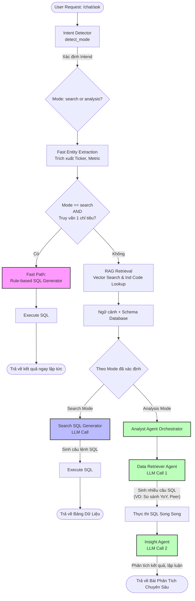

# Kiến trúc Hybrid Chatbot AI

Dưới đây là sơ đồ kiến trúc luồng xử lý của hệ thống Chatbot AI lai (Hybrid) được xây dựng cho dự án. Kiến trúc này kết hợp giữa:
1. **Rule-based (Heuristic)**: Xử lý siêu tốc các câu hỏi tra cứu chỉ số đơn giản (Fast Path).
2. **LLM Text-to-SQL + RAG**: Xử lý các câu hỏi tra cứu dữ liệu phức tạp cần truy xuất database.
3. **Multi-Agent (Analyst & Insight)**: Xử lý các câu hỏi phân tích đa chiều thông qua nhiều Agent phối hợp.

## Các thành phần chính

1. **Intent Detector**: Phân loại ý định của người dùng dựa trên từ khóa (ví dụ: "giá", "P/E" -> Search; "phân tích", "đánh giá" -> Analysis).
2. **Fast Entity Extraction**: Trích xuất nhanh các thực thể tài chính như mã cổ phiếu, chỉ số tài chính cơ bản để phục vụ Fast Path.
3. **Fast Path**: Nếu người dùng chỉ hỏi 1 chỉ số cơ bản của 1 mã cổ phiếu (VD: "P/E của FPT"), hệ thống sẽ tự động sinh SQL bằng quy tắc (Rule-based) và bỏ qua bước gọi LLM để tối ưu tốc độ.
4. **RAG Retrieval**: Dùng Vector Search để tìm kiếm các Schema / Metadata liên quan và tra cứu mã ngành (Industry Code) để cung cấp Context cho LLM.
5. **Analyst Agent**: Cấu trúc Multi-Agent gồm:
   - **Data Retriever Agent**: Chịu trách nhiệm viết nhiều truy vấn SQL để lấy dữ liệu đa chiều (VD: lịch sử quá khứ, dữ liệu ngành, đối thủ cạnh tranh).
   - **Insight Agent**: Nhận kết quả từ Data Retriever, đọc hiểu số liệu và viết ra lời nhận xét phân tích cuối cùng.
